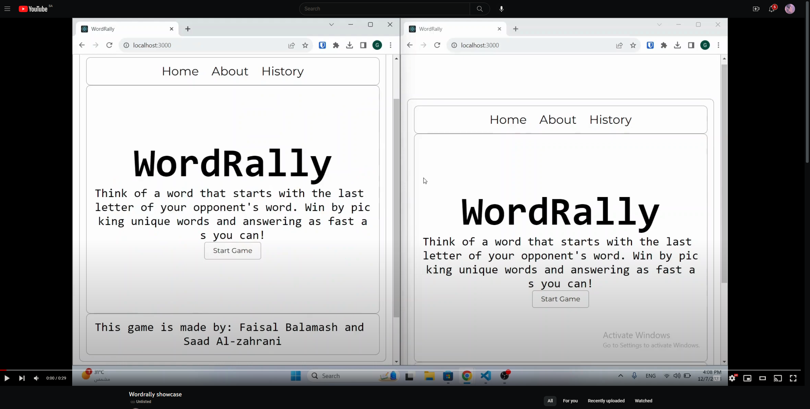

# WordRally

  

WordRally is a multiplayer word game inspired by the Japanese game "shiritori" with some unique twists.

## Showcase 

## Table of Contents

- [Introduction](#introduction)

- [Features](#features)

- [Getting Started](#getting-started)

- [Prerequisites](#prerequisites)

- [Installation](#installation)

- [Running the Application](#running-the-application)

- [Gameplay](#gameplay)

- [Components](#components)

- [About](#about)

- [GameStartPage](#gamestartpage)

- [HistoryPage](#historypage)

- [WordRally](#wordrally)

- [useWordRallyGame](#usewordrallygame)

- [Styling](#styling)

- [API Endpoints](#api-endpoints)

- [Database](#database)

- [Acknowledgments](#acknowledgments)

- [Screenshots](#screenshots)

## Introduction

  

WordRally is a web-based multiplayer game built with React and Socket.IO. The game follows the rules of "shiritori," where players take turns saying words that begin with the last letter of the previous word.

  

## Features

  

- Real-time multiplayer gaming using Socket.IO

- Match history recording and retrieval

- Interactive and user-friendly interface

  

## Getting Started

  

### Prerequisites

  

- Node.js (v14.0 or later)

- npm (Node Package Manager)

  

### Installation

  

1. Clone the repository:

  

git clone https://github.com/WordRally/wordrally.git

cd wordrally

2.  Install dependencies:

`npm install` 

### Running the Application

`cd client`
`npm start`
`cd server`
`node index.js`

Visit [http://localhost:3000](http://localhost:3000/) in your web browser.

## Gameplay

-   Players take turns submitting words that start with the last letter of the opponent's word.
-   The game provides feedback on the validity of the submitted word.
-   The player with the fastest and most unique submissions wins.

## Components

### About

The About component provides information about the game.

### GameStartPage

The GameStartPage component handles the initiation of a new game.

### HistoryPage

The HistoryPage component displays the match history.

### WordRally

The WordRally component represents the main gameplay screen.

### useWordRallyGame

The useWordRallyGame hook manages the game state and interactions.

## Styling

The styling is done using CSS, providing a clean and visually appealing interface.

## API Endpoints

-   `/api/history`: Retrieve match history.
-   `/record-game`: Record game results (POST request).

## Database

The game uses MariaDB for recording and retrieving match history.

## Screenshots
- homepage

- Match 

- Match history page

- about 

